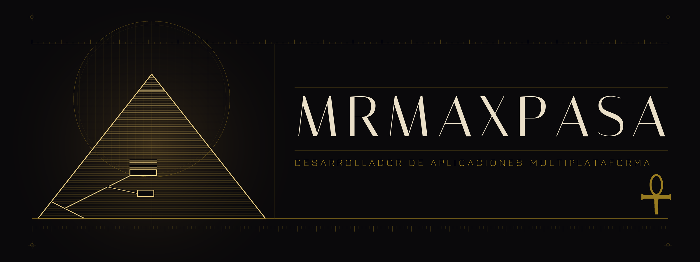
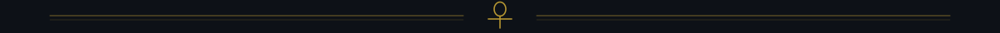
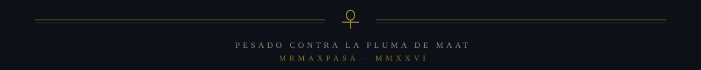

### I · Nota del catálogo

Desarrollador de aplicaciones multiplataforma. Construyo apps pensadas para durar: código legible, decisiones documentadas y despliegues que no dependen de la memoria de nadie. 

| | |
|:--|:--|
| **Rol** | Developer multiplataforma |
| **Enfoque** | Apps multiplataforma — para poder trabajar desde cualquier rincón del mundo |
| **Herramienta principal** | JavaScript/TypeScript · React · Node.js · Python · Kotlin · C# · SQL/NoSQL — full stack, de la base de datos a la interfaz |
| **Ubicación** | Remoto — donde haya wifi, y si no, datos |
| **Idiomas** | Español · English · Français · Català |

### II · Instrumental

### III · Registro

 

### IV · Estratigrafía

### V · Hallazgos

### VI · Correspondencia

 

<b>Notas de excavación</b>

 

**Sobre la cartela.** El banner es una lámina propia (`assets/piramide.png`); los filetes y el pie son SVG propios. Nada de esto son servicios externos: se cargan siempre, no dependen de que un tercero siga en pie y llevan `#0d1117` de fondo para fundirse sin costuras con el modo oscuro de GitHub.

**Paleta.** Oro `#D4AF37` · oro claro `#F3D77A` · arena `#F5E6C8` · carbón `#0d1117`.

**Tipografía.** En los SVG, Georgia con reserva a Times New Roman y Liberation Serif. La renderiza el navegador de quien mire el perfil, así que en sistemas sin ninguna de las tres caerá a la serif por defecto. El texto del banner va incrustado en la imagen, así que ahí no depende de nada.

**La serpiente.** La genera `.github/workflows/snake.yml` con [Platane/snk](https://github.com/Platane/snk) y se publica en la rama `output`. Corre cada noche a las 03:00 UTC y se puede lanzar a mano desde la pestaña *Actions*.

**Las estadísticas.** Las genera `.github/workflows/metrics.yml` con [lowlighter/metrics](https://github.com/lowlighter/metrics) y quedan commiteadas en `metrics/` dentro del propio repo, a las 03:30 UTC. Se sirven desde aquí, así que no dependen de ningún servicio externo en el momento de cargar el perfil. La racha sí es externa (`streak-stats.demolab.com`).

**Pendiente.** Poner los enlaces de Discord y X en la sección VI, que ahora apuntan a `#`.

