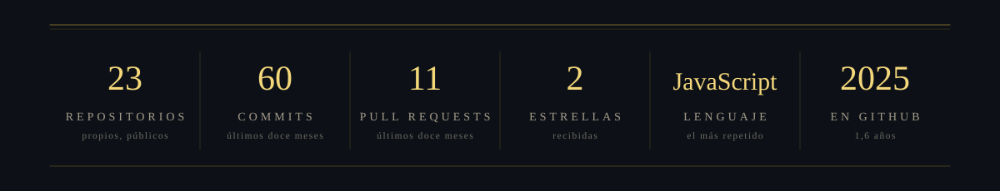

### I · Nota del catálogo

Desarrollador de aplicaciones multiplataforma. Construyo apps pensadas para durar: código legible, decisiones documentadas y despliegues que no dependen de la memoria de nadie. 

| | |
|:--|:--|
| **Rol** | Developer multiplataforma |
| **Enfoque** | Apps multiplataforma — para poder trabajar desde cualquier rincón del mundo |
| **Herramienta principal** | JavaScript/TypeScript · React · Node.js · Python · Kotlin · C# · SQL/NoSQL — full stack, de la base de datos a la interfaz |
| **Ubicación** | Remoto — donde haya wifi, y si no, datos |
| **Idiomas** | Español · English · Français · Català |

### II · Instrumental

### III · Registro

### IV · Estratigrafía

### V · Hallazgos

### VI · Correspondencia

 

<b>Notas de excavación</b>

 

**Sobre la cartela.** El banner es una lámina propia (`assets/piramide.png`); los filetes y el pie son SVG propios. Nada de esto son servicios externos: se cargan siempre, no dependen de que un tercero siga en pie y llevan `#0d1117` de fondo para fundirse sin costuras con el modo oscuro de GitHub.

**Paleta.** Oro `#D4AF37` · oro claro `#F3D77A` · arena `#F5E6C8` · carbón `#0d1117`.

**Tipografía.** En los SVG, Times New Roman con reserva a Times, Liberation Serif y Nimbus Roman: trazo fino y contrastado, versales y mucho tracking, que es lo más cerca que se puede quedar de la letra del banner con fuentes que estén en casi todas las máquinas. La renderiza el navegador de quien mire el perfil, así que en un sistema sin ninguna de las cuatro caerá a la serif por defecto. El texto del banner va incrustado en la imagen, así que ahí no depende de nada.

**Lo que no se puede unificar.** GitHub borra el CSS del README —`<style>` sale escapado como texto y los atributos `style` se eliminan al sanear el HTML—, así que no hay forma de imponer una tipografía a todo el documento. Los títulos de sección y la nota del catálogo van con la fuente de GitHub, y las insignias, los iconos y la racha traen la suya. Solo se controla la letra de lo que va dentro de un SVG o un PNG.

**La serpiente.** La genera `.github/workflows/snake.yml` con [Platane/snk](https://github.com/Platane/snk) y se publica en la rama `output`. Corre cada noche a las 03:00 UTC y se puede lanzar a mano desde la pestaña *Actions*.

**Los hallazgos.** La lámina de la sección V la dibuja `.github/workflows/hallazgos.yml` con un script propio (`.github/scripts/hallazgos.mjs`, sin dependencias) y queda commiteada en `assets/hallazgos.svg` a las 03:30 UTC. Las cifras salen de la API de GitHub y se sirven desde aquí, así que no dependen de nadie al cargar el perfil. Antes había trofeos de un servicio externo que acabó cayéndose.

**La racha.** Es externa (`streak-stats.demolab.com`): se calcula al vuelo cada vez que alguien abre el perfil, así que depende de que ese servicio siga en pie. Es la única pieza de la sección III que no vive en este repo.

**Pendiente.** Poner los enlaces de Discord y X en la sección VI, que ahora apuntan a `#`.

