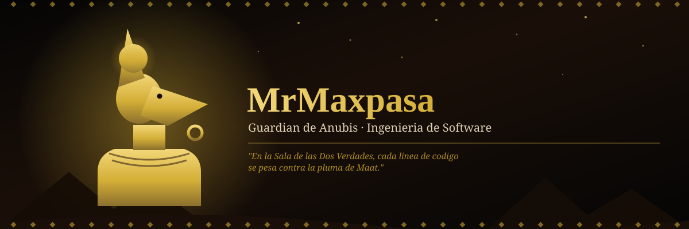
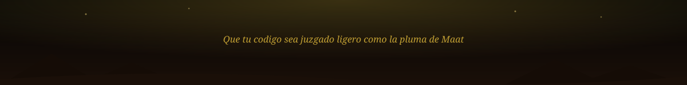

<div align="center">



</div>

<div align="center">

```
╔══════════════════════════════════════════════╗
║                                              ║
║               ☥   A N U B I S   ☥            ║
║                                              ║
║         Guardián del Inframundo Digital      ║
║                                              ║
╚══════════════════════════════════════════════╝
```

</div>


### Sobre mí

Ingeniero/a de software con la precisión de un embalsamador y la disciplina de un guardián del Duat. Guío cada proyecto desde su concepción hasta su despliegue, cuidando que nada se pierda en el camino.

| | |
|---|---|
| **Rol** | Ingeniero/a de Software |
| **Enfoque actual** | *(completa con tu stack o especialidad)* |
| **Filosofía** | Código limpio, o el caos del Duat |
| **Referente mitológico** | Anubis — dios del embalsamamiento, la muerte y el tránsito a la otra vida |


### Stack Tecnológico

<div align="center">


*(edita la lista `i=` en el enlace con tus tecnologías reales — [ver iconos disponibles](https://skillicons.dev))*

</div>


### La Balanza de Maat — Estadísticas

<div align="center">


</div>

<div align="center">


</div>


### El Sendero del Duat — Actividad anual

<div align="center">


</div>


### Logros

<div align="center">


</div>


### Contacto

<div align="center">

<a href="https://github.com/MrMaxpasa"></a>
<a href="#"></a>
<a href="#"></a>

</div>

